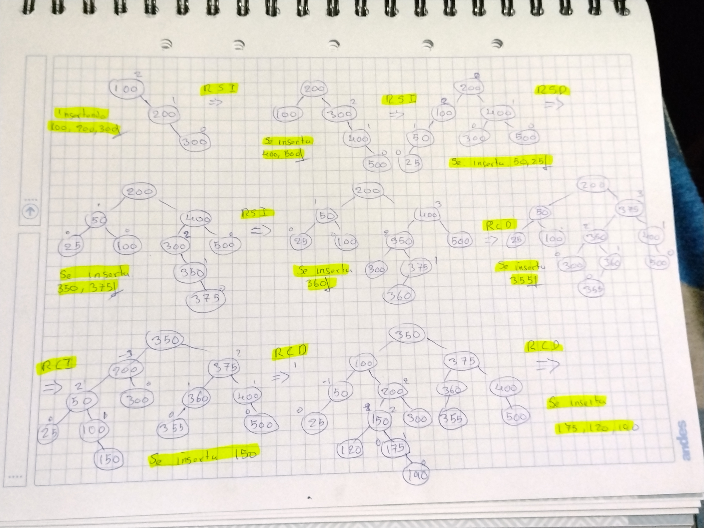
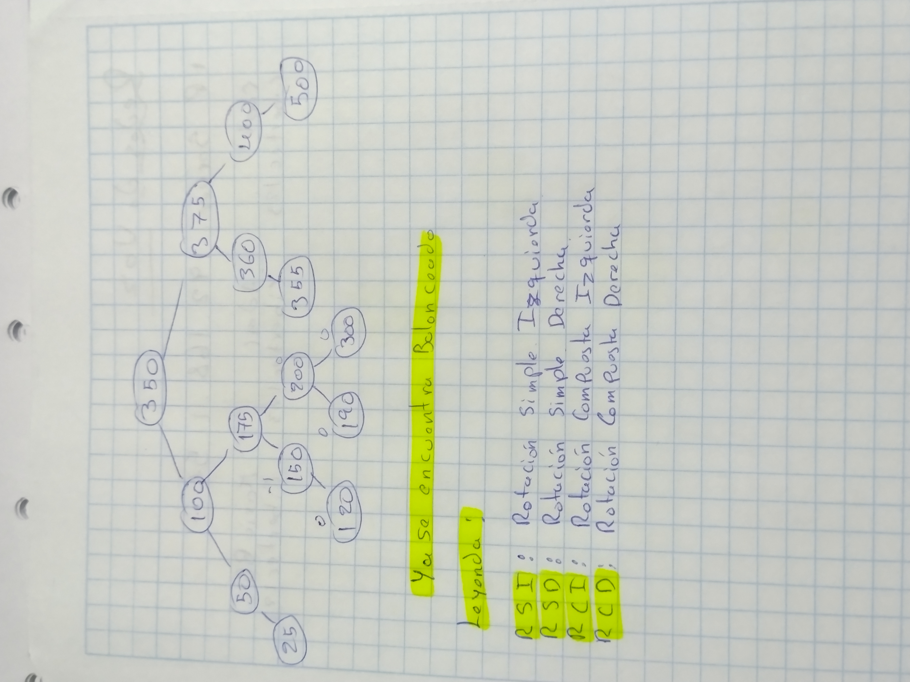
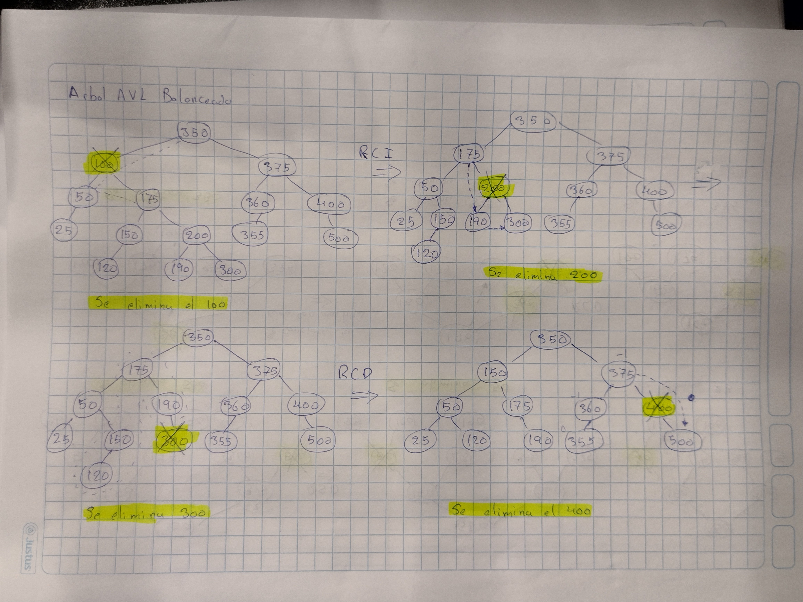
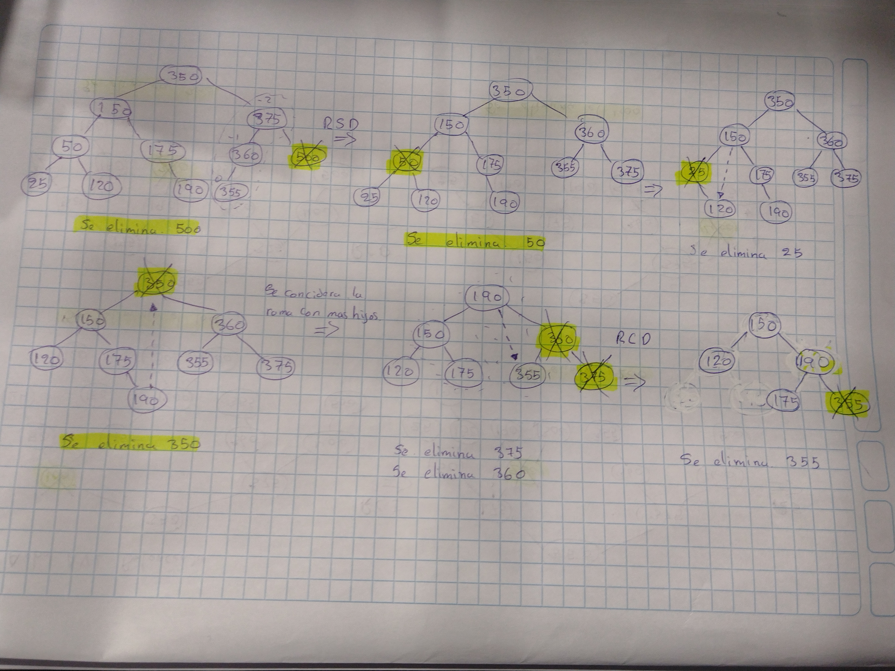

<table>
    <theader>
        <tr>
            <td></td>
            <th>
                UNIVERSIDAD NACIONAL DE SAN AGUSTIN 
                FACULTAD DE INGENIERÍA DE PRODUCCIÓN Y SERVICIOS 
                DEPARTAMENTO ACADÉMICO DE INGENIERÍA DE SISTEMAS E INFORMÁTICA 
                ESCUELA PROFESIONAL DE INGENIERÍA DE SISTEMAS
            </th>
            <td></td>
        </tr>
    </theader>
    <tbody>
        <tr><td colspan="3">Formato: Guía de Práctica de Laboratorio</td></tr>
        <tr><td>Aprobación:  2022/03/01</td><td>Código: GUIA-PRLD-001</td><td>Página: 1</td></tr>
    </tbody>
</table>

INFORME DE LABORATORIO 

<table>
<theader>
<tr><th colspan="6">INFORMACIÓN BÁSICA</th></tr>
</theader>
<tbody>
<tr><td>ASIGNATURA:</td><td colspan="5">Estructura de Datos y Algoritmos</td></tr>
<tr><td>TÍTULO DE LA PRÁCTICA:</td><td colspan="5">Árboles</td></tr>
<tr>
<td>NÚMERO DE PRÁCTICA:</td><td>05</td><td>AÑO LECTIVO:</td><td>2022 A</td><td>NRO. SEMESTRE:</td><td>III</td>
</tr>
<tr>
<td>FECHA INICIO:</td><td>12-Jun-2022</td><td>HORA DE PRESENTACION:</td><td>23:55</td>
</tr>
<tr><td colspan="6">INTEGRANTES:
    <ul>
        <li>Silva Pino Jesus Francisco - jsilva@unsa.edu.pe</li>        
    </ul>
    <td>NOTA:</td><td></td>
<tr>
<tr><td colspan="6">DOCENTES:
<ul>
<li>Richart Smith Escobedo Quispe - rescobedoq@unsa.edu.pe</li>
</ul>
</td>
</<tr>
</tdbody>
</table>

# Árboles

[![License][license]][license-file]
[![Downloads][downloads]][releases]
[![Last Commit][last-commit]][releases]

[![Debian][Debian]][debian-site]
[![Git][Git]][git-site]
[![GitHub][GitHub]][github-site]
[![Vim][Vim]][vim-site]
[![Java][Java]][java-site]

#

# SOLUCIÓN Y RESULTADOS

## EJERCICIOS PROPUESTOS

-   5.1 Corchetes equilibrados

    -   Se considera corchete cualquiera de los siguientes caracteres: (, ), {, }, [, o ]. 
    -   Se considera que dos corchetes son un par coincidente si un corchete de apertura (es decir, (, [, o ) aparece a la izquierda de un corchete de cierre (es decir, ), ] o ) del mismo tipo exacto. Hay tres tipos de pares de corchetes coincidentes: [], {} y ().
    -   Un par de corchetes coincidentes no está equilibrado si el conjunto de corchetes que encierra no coinciden.
    -   Por ejemplo, {[(])} no está equilibrado porque los contenidos entre { y } no están equilibrados.
    -   El par de corchetes encierra un solo corchete de apertura no balanceado, (, y el par de paréntesis encierra un solo corchete de cierre no balanceado, ].
    -   Por esta lógica, decimos que una secuencia de paréntesis está balanceada si se cumplen las siguientes condiciones:
        -   No contiene paréntesis que no coincidan.
        -   El subconjunto de corchetes encerrado dentro de los límites de un par de corchetes emparejados también es un par de corchetes emparejados.
    -   Dadas n cadenas de corchetes, determine si cada secuencia de corchetes está balanceada. 
        -   Si una cadena está balanceada, devuelve SÍ. 
        -   De lo contrario, devuelva NO.
    -   Función descriptiva
        -   Completa la función isBalanced. 
        -   isBalanced tiene los siguientes parámetros:
            -   string s: una cadena de corchetes
            -   Devoluciones
            -   cadena: ya sea SÍ o NO
        -   Ejemplos
            -   s='{[()]}' devuelve SÍ.
            -   s='[(])' devuelve NO.
            -   s='[[(())]]' devuelve SÍ.

#

-   5.2 Operaciones de árbol AVL
    -   Simule las siguientes operaciones de un árbol AVL
    -   1. Inserción: 100 - 200 - 300 - 400 - 500 - 50 - 25 - 350 - 375 - 360 - 355 - 150 - 175 - 120 - 190.
    -   2. Después de crear un árbol AVL, realice la eliminación: 100 - 200 - 300 - 400 - 500 - 50 - 25 - 350 - 375 - 360 - 355 - 150 - 175 - 120 - 190.
    -   Para este ejercicio tienes que escribir el paso a paso del desarrollo de cada operación donde se muestra gráficamente el estado del árbol así como el factor de equilibrio para cada nodo y el tipo de operación que se está realizando, es decir, inserción, eliminación, rotación.
    -   Este ejercicio no requiere implementación, solo escribe el desarrollo de cada uno operación paso a paso e incluirlo en el informe.

-   5.3 Árbol AVL
    -   Implementa un AVL con tipos genéricos siguiendo las interfaces 
    -   ¿Cómo empezar?
    -   (i) Implemente una clase Node<T> donde T es un tipo genérico, esta clase debe contener al menos el  siguientes propiedades.
        -   Para obtener más información sobre la verificación genérica: https://docs.oracle.com/javase/tutorial/java/generics/types.html
        -   1. Datos T: la información almacenada en el nodo.
        -   2. Node<T> rightNode: una referencia al siguiente nodo.
        -   3. Node<T> leftNode: una referencia al nodo anterior.
        -   4. Int balanceFactor: el factor de equilibrio del nodo.
    -   (ii) Implemente las clases AVLTree<T> que deben contener al menos estas propiedades
        -   1. Node<T> root: la referencia sobre el nodo inicial.
    -   (iii) Lectura sugerida:
        -   https://algorithmtutor.com/Data-Structures/Tree/AVL-Trees/

## SOLUCION
-   EJERCICIO02
    -   este ejercicio se resolvio a mano, se adjunta las imagenes con los procedimientos necesarios para realizar este ejercicio
    
    
    
    

## REFERENCIAS
    - https://www.w3schools.com/java/
    - https://www.eclipse.org/downloads/packages/release/2022-03/r/eclipse-ide-enterprise-java-and-web-developers
    -   https://algorithmtutor.com/Data-Structures/Tree/AVL-Trees/
    -   https://docs.oracle.com/javase/tutorial/java/generics/types.html

#

[license]: https://img.shields.io/github/license/rescobedoq/pw2?label=rescobedoq
[license-file]: https://github.com/rescobedoq/pw2/blob/main/LICENSE

[downloads]: https://img.shields.io/github/downloads/rescobedoq/pw2/total?label=Downloads
[releases]: https://github.com/rescobedoq/pw2/releases/

[last-commit]: https://img.shields.io/github/last-commit/rescobedoq/pw2?label=Last%20Commit

[Debian]: https://img.shields.io/badge/Debian-D70A53?style=for-the-badge&logo=debian&logoColor=white
[debian-site]: https://www.debian.org/index.es.html

[Git]: https://img.shields.io/badge/git-%23F05033.svg?style=for-the-badge&logo=git&logoColor=white
[git-site]: https://git-scm.com/

[GitHub]: https://img.shields.io/badge/github-%23121011.svg?style=for-the-badge&logo=github&logoColor=white
[github-site]: https://github.com/

[Vim]: https://img.shields.io/badge/VIM-%2311AB00.svg?style=for-the-badge&logo=vim&logoColor=white
[vim-site]: https://www.vim.org/

[Java]: https://img.shields.io/badge/java-%23ED8B00.svg?style=for-the-badge&logo=java&logoColor=white
[java-site]: https://docs.oracle.com/javase/tutorial/

[![Debian][Debian]][debian-site]
[![Git][Git]][git-site]
[![GitHub][GitHub]][github-site]
[![Vim][Vim]][vim-site]
[![Java][Java]][java-site]

[![License][license]][license-file]
[![Downloads][downloads]][releases]
[![Last Commit][last-commit]][releases]